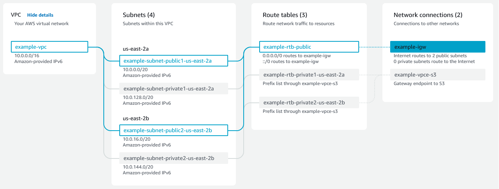

### Q&A

1. 

   
What are services scopes in AWS ?

   

    

    AWS provides a lot of services and these services are either Global, Regional, or Availability Zone (AZ) specific.

   

   

1. 

   
What is a IAM service and how does it works ?

   

   

   - **users** - refers to a single person or an application. 
   - **groups** - a set of users put under a group to apply similar policies (eg: People in Dev group will have write access and QA group will have read access for a DB)
   - **roles** - it is used to grant specific permission to specific actors (AWS service or trusted external system) for a temporary period (certain duration of time). (eg: When AWS EC2 service need access to S3 buckets)

   

   

1. 

   
What is VPC ?

   

   VPC stands for Virtual Private Cloud. It allows users to create isolated and logically defined networks within the cloud environment. Multiple VCPs can be created in a Region and its span across multiple Availability Zones(AZ).

   

   

1. 

   
What are the components involved in VPC ?

   

   

   - **CIDR** - Classless Inter-Domain Routing (CIDR) is an IP address allocation method that improves data routing efficiency on the internet.
      - **CIDR notation** - w.x.y.z/n (/n declares the total number of bits in the entire IP address) allows to express IP address ranges and subnet configurations. This is also known as CIDR block.

         Ex: CIDR block 192.168.0.0/24 represents a subnet that includes IP addresses from 192.168.0.1 to 192.168.0.254. The "/24" prefix length means that the first 24 bits of the IP address are fixed (representing the network address), and the remaining 8 bits are variable (representing the host addresses)

   - **Subnets** - It is a range of IP addresses allocated from the VPC's IP address space (CIDR range)
   - **Route table** - It is a set of rules (routes) that dictate how network traffic should be directed within a VPC. Each subnet in a VPC is associated with a route table, and the rules in that table determine where the traffic within that subnet should be sent. A route table typically contains two types of routes: local routes, which allow communication between instances within the same subnet, and custom routes, which determine the destination of traffic going outside the subnet. Custom routes are essential for directing traffic to other subnets within the VPC or to external resources like the internet.
   - **Internet Gateway** - An Internet Gateway allows resources within a VPC to communicate with the internet and vice versa. It acts as a bridge between the VPC and the public internet
   - **Network Address Translation** - NAT is a technique used to map private IP addresses used within a private network (e.g., instances in private subnets) to a single public IP address when accessing resources on the internet. This allows instances in private subnets to communicate with the internet without exposing their private IP addresses directly. NAT can be done in two ways:

      **NAT Gateway**: A NAT Gateway is a managed service provided by the cloud provider. It allows instances in private subnets to access the internet, and it handles the NAT translation for the instances.

      **NAT Instance**: A NAT instance is a regular EC2 instance deployed in a public subnet with special configurations to handle NAT. It acts as an intermediary between the private instances and the internet, performing the NAT translations.

   

   

1. 

   

   

   

   

1. 

   

   

   

   

1. 

   

   

   

   

### Resources

- [AWS documentation](https://docs.aws.amazon.com/index.html)